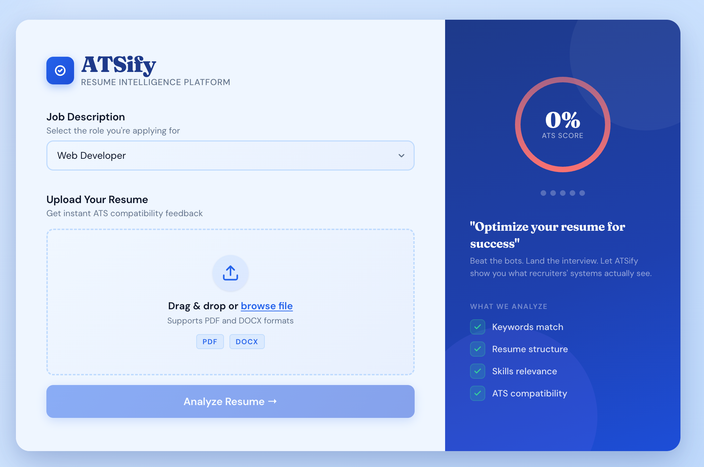
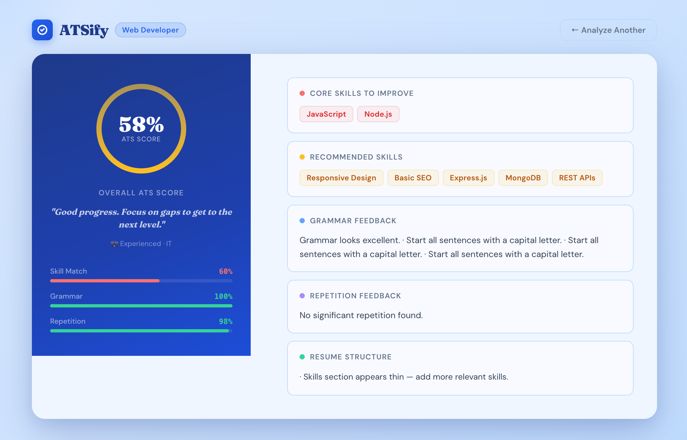

# ATS Resume Analyzer 🚀

An AI-powered ATS (Applicant Tracking System) Resume Analyzer that evaluates resumes based on job roles, skills, grammar, and structure.

---

## 🔗 Live Demo

👉 https:atsify-resume-analyzer-15zv.vercel.app


---

## 📌 Features

* 🎯 **Role-Based Scoring**
  Evaluates resumes based on selected job role (IT, Photographer, etc.)

* 🧠 **Smart Skill Detection**
  Detects both text-based and logo-based skills from resumes

* ✍️ **Grammar Analysis**
  Provides intelligent grammar feedback with scoring

* 📊 **Detailed Score Breakdown**

  * Core Skills
  * Recommended Skills
  * Grammar
  * Repetition

* 💡 **AI-like Feedback System**
  Suggests improvements for better ATS performance

* 🎨 **Modern UI Dashboard**
  Clean, responsive design with smooth transitions

---

## 🛠️ Tech Stack

* Frontend: React.js
* Language: JavaScript
* Styling: CSS
* Deployment: Vercel

---

## ⚙️ How It Works

1. Upload your resume (PDF/DOC)
2. Select job role
3. Click **Analyze**
4. Get:

   * ATS Score
   * Skill match %
   * Grammar score
   * Improvement suggestions

---

## 📸 Screenshots

<p align="center">
  
  
</p>

---

## 🚀 Getting Started (Local Setup)

```bash
git clone https://github.com/vinodhinipalanikumar/atsify-resume-analyzer.git
cd atsify-resume-analyzer
npm install
npm start
```

---

## 📁 Project Structure

```
src/
 ├── App.js
 ├── components/
 ├── styles/
 └── utils/
```

---

## 🎯 Future Improvements

* Download analysis as PDF
* Dark mode support
* More job role customization
* AI-powered resume rewriting

---

## 👩‍💻 Author

Vinodhini P

---

## ⭐ If you like this project

Give it a star on GitHub!
